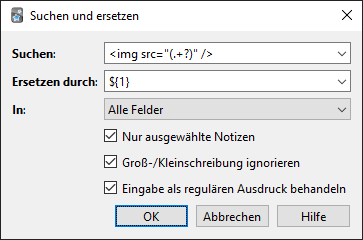

# Kartenverwaltung

<!-- toc -->

Mit der Kartenverwaltung kannst du in deinen Karten und Notizen stöbern und sie
bearbeiten. Du öffnest sie, indem du im Hauptfenster auf _Kartenverwaltung_ klickst
oder <kbd>B</kbd> drückst. Sie besteht aus drei Bereichen: der Seitenleiste links,
der Karten- bzw. Notiztabelle oben rechts und dem Bearbeitungsbereich unten rechts.
Du kannst einen Bereich vergrößern und einen anderen verkleinern, indem du auf
den Bereich dazwischen klickst und ziehst.

## Tabellenmodi

Anki 2.1.45+ bietet zwei Modi: Entwerden werden Karten oder Notizen in der Tabelle
angezeigt. Du kannst den aktuellen Modus ändern, indem du den Schalter oben, links
neben dem Suchbereich anklickst oder <kbd>Alt</kbd>+<kbd>T</kbd> drückst.
Der Schalter gibt auch Auskunft darüber, ob gerade **K**arten oder **N**otizen
angezeigt werden.

**Anmerkung**: Der Einfachheit halber wird in diesem Leitfaden meistens angenommen,
dass der Kartenmodus aktiv ist. Wenn davon die Rede ist, Karten auszuwählen, zu
finden usw., gilt das dementsprechend auch für Notizen, wenn der Notizmodus
aktiv ist.

## Seitenleiste

Die Seitenleiste links gewährt schnellen Zugriff auf gebräuchliche Suchbegriffe.
In Anki 2.1.45+ bietet sie auch eine Suchleiste, Funktionen, um Schlagwörter und
Stapel zu bearbeiten, und eine Auswahl von zwei Werkzeugen, die in den nächsten
Abschnitten erklärt werden. Du kannst zwsichen den Werkzeugen mit der Werkzeugleiste
oben in der Seitenleiste oder mit den Tastenkombinationen
<kbd>Alt</kbd>+<kbd>1</kbd>/<kbd>2</kbd> wechseln.

### Suchwerkzeug

Mit diesem Werkzeug verhält sich die Leistenleiste wie in früheren Versionen:
Auf einen Eintrag zu klicken, löst eine Suche danach aus.

Du kannst <kbd>Strg</kbd> (<kbd>Befehl</kbd> auf dem Mac) gedrückt halten, um
den angeklickten Eintrag mit einer _AND_-Bedingung ("und") an die aktuelle Suche
anzuhängen, anstatt eine neue zu starten. Wenn du z.B. Lernkarten sehen wolltest,
die sich außerdem im Englisch-Stapel befinden, könntest du auf _Lernen_ klicken
und dann auf _Englisch_ <kbd>Strg</kbd>-klicken.

Du kannst die <kbd>Umschalttaste</kbd> gedrückt halten, um eine _OR_- ("oder") statt
eine _AND_-Suche zu erzeugen. Indem du mehrere Stapel mit <kbd>Umschalttaste</kbd>
anklickst, kannst du so alle Karten gleichzeitig anzeigen lassen, die sich in einem
dieser Stapel befinden.

Du kannst <kbd>Alt</kbd> (<kbd>Wahl</kbd> auf dem Mac) gedrückt halten, um
die Suche umzukehren (`-` voranzustellen), z.B. um alle Karten anzuzeigen, die
ein bestimmtes Schlagwort _nicht_ haben. <kbd>Alt</kbd> / <kbd>Wahl</kbd> können
mit <kbd>Strg</kbd> oder <kbd>Umschalttaste</kbd> kombiniert werden. So wird
das Klicken mit <kbd>Strg</kbd>+<kbd>Alt</kbd> einen negierten Ausdruck an die
Suche anhängen.

In Anki 2.1.39+ kannst du auch <kbd>Strg</kbd> und <kbd>Umschalttaste</kbd>
gedrückt halten, um alle Suchausdrücke derselben Art mit dem neuen zu ersetzen.
Angenommen, du hast eine komplexe Suche wie `deck:Swahili (is:due or tag:wichtig)`
eingegeben und möchtest dieselbe Suche nun für deinen Urdu-Stapel durchführen.
Du kannst <kbd>Strg</kbd>+<kbd>Umschalttaste</kbd> gedrückt halten, während du
auf den Urdu-Stapel in der Seitenleiste klickst, um die folgende Suche zu erhalten:
`deck:Urdu (is:due or tag:wichtig)`.

### Auswahlwerkzeug

Das Auswahlwerkzeug ermöglicht es, mehrere Einträge gleichzeitig auszuwählen,
indem beim Klicken <kbd>Strg</kbd> oder <kbd>Umschalttaste</kbd> gedrückt wird.
Es unterstützt auch _Drag-and-drop_ ("Ziehen und Ablegen"), um Stapel und Schlagwörter
neu anzuordnen.

Dazu ein Beispiel: Angenommen, du hast die Schlagwörter `Mathe`, `Analysis` und
`Algebra`. Klick das Schlagwort `Analysis` und dann mit <kbd>Strg</kbd> `Algebra`
an. Nun sind beide ausgewählt und du kannst eines von beiden anklicken und auf
`Mathe` ziehen, um beide zu Kindern von diesem Schlagwort zu machen.
Hinter den Kulissen hat Anki die beiden Schlagwörter zu `Mathe::Analysis` bzw.
`Mathe::Algebra` umbenannt und deine Notizen entsprechend aktualisiert.

Auch beim Suchen ist die Auswahl mehrerer Einträge nützlich: Wenn du eine Auswahl
rechtsklickst, gibt es die Optionen _Suchen &gt; Alle ausgewählten / Eins der ausgewählten_.
Das kann mit den verschiedenen Umschalttasten wie im Abschnitt [Suchwerkzeug](#search-tool)
beschrieben kombiniert werden, um das Ergebnis an die aktuelle Suche anzuhängen.

### Gespeicherte Suchen

Wenn du oft nach demselben suchst, kansnt du deine aktuelle Suche speichern, indem
du den obersten Eintrag in der Seitenleiste rechtsklickst, "Aktuelle Suche speichern"
auswählst und einen Namen eingibst.

### Einträge bearbeiten

Du kannst Schlagwörter, Stapel und gespeicherte Suchen direkt von der Seitenleiste
aus entfernen oder umbenennen. Das geht vom Rechtsklickmenü aus oder unter
Benutzung der jeweiligen Taste (in Windows <kbd>Entf</kbd> bzw. <kbd>F2</kbd>).
Es können sogar mehrere Einträge gleichzeitig gelöscht werden (siehe
[Auswahlwerkzeug](#selection-tool)).

### Einträge finden

Um einen bestimmten Eintrag im Seitenleistenbaum zu finden, kannst du einen Teil
seines Namens oben in die Suchleiste eingeben, wodurch unpassende Einträge zeitweise
ausgeblendet werden.

## Suchleiste

Über der Kartentabelle befindet sich eine Suchleiste, in die du Verschiedenes
eingeben kannst, um nach Karten zu suchen. Für weitere Informationen zur Syntax
siehe bitte das Kapitel [Suchen](searching.md).

## Karten-/Notiz-Tabelle

Die Reihen der Tabelle zeigen Karten oder Notizen, die zur aktuellen Suche passen.
Wenn du eine Reihe anklickst, wird die dazugehörige Notiz im Bereich darunter
angezeigt.

### Reihen

Wenn du mit der Maus ziehst oder <kbd>Strg</kbd> bzw. <kbd>Command</kbd> benutzt,
um mehrere Reihen auszuwählen, wird der Bearbeitungsbereich ausgeblendet.
Verschiedene Funktionen (wie das Ändern des Stapels) können für mehrere Karten
oder Notizen gleichzeitig ausgeführt werden, unabhängig vom aktuellen Modus.
Dafür gilt im Kartenmodus eine Notiz als ausgewählt, wenn eine ihrer Karten
ausgewählt ist, und im Notizmodus gilt eine Karte als ausgewählt, wenn ihre
Notiz ausgewählt ist.

Andere Funktionen (wie das Zeigen der Kartenstatisik) werden nur für eine einzelne
Karte oder Notiz ausgeführt. Diese wird als _aktuelle_ Karte bzw. Notiz bezeichnet
und ist im Normalfall die zuletzt ausgewählte oder angeklickte.
Im Kartenmodus ist die aktuelle Notiz wieder die der aktuellen Karte und im
Notizmodus ist die aktuelle Karte die erste Karte der aktuellen Notiz.

Die Hintergrundfarbe hängt von Karte und Notiz ab. Im Kartenmodus gelten folgende
Regeln (nach Priorität):

1. Die Farbe der Kartenmarkierung, falls vorhanden.
2. Gelb, falls die Karte ausgesetzt ist.
3. Lila, falls die Karte zurückgestellt ist.

Im Notizmodus werden nur [gekennzeichnete](editing.md#das-schlagwort-marked)
Notizen farbig hinterlegt. Für weitere Informationen über gekennzeichnete Notizen
und ausgesetzte Karten, siehe den Abschnitt
[Bearbeiten und Sonstiges](studying.md#bearbeiten-und-sonstiges).

### Spalten

Du kannst festlegen, welche Spalten angezeigt werden sollen, indem du einen
Spaltenkopf rechtsklickst (auf einem Mac mit <kbd>Strg</kbd> anklickst).
Durch Ziehen mit der Maus kannst du die Reihenfolge festlegen. Durch Klicken
auf einen Spaltenkopf kannst du nach der jeweiligen Spalte sortieren lassen,
ein weitere Klick kehrt die Reihenfolge um.
Du kannst allerdings nicht nach den Spalten Frage oder Antwort sortieren lassen.

Alle Spalten sind sowohl im [Karten- als auch im Notizmodus](#table-modes) verfügbar,
jedoch manchmal mit leicht unterschiedlichen Namen oder Daten. Die folgende Tabelle
listet das Verhalten in beiden Modi auf:

<!-- prettier-ignore -->
| Spalte | Kartenmodus | Notizmodus |
|-|-|-|
| Antwort | Die Kartenrückseite ohne die Frage als Einzeiler. Im Kartentypeneditor kann ein [alternatives Format](templates/styling.md#browser-appearance) festgelegt werden. | Wie im Kartenmodus für die erste Karte der Notiz. |
| Karte(n) | Der Name der Kartenvorlage. | Die Anzahl der Karten der Notiz. |
| Karte verändert | Das letzte Mal, dass an der Karte Änderungen vorgenommen wurden (z.B. wenn du die Karte wiederholt hast und die Kartenhistorie aktualisiert wurde). | Das letzte Mal, dass an einer der Karten der Notiz Änderungen vorgenommen wurden. |
| Erstellt | Wie im Notizmodus für die Notiz der Karte. | Wann die Notiz erstellt wurde. |
| Stapel | Der Name des Stapels, in dem sich die Karte befindet. | Die Anzahl verschiedener Stapel, die Karten der Notiz enthalten, oder der Name des Stapels, wenn sich alle Karten im selben befinden. |
| Fällig | Das Fälligkeitsdatum für Wiederholungs- und Wiedererlernungskarten und für neue Karten die Position in der Schlange ebendieser Karten. Die Zeile ist eingeklammert, wenn die Karte ausgesetzt oder zurückgestellt ist. Sortiert wird zuerst nach Typ und erst dann nach Datum oder Position. | Das Fälligkeitsdatum für die nächste fällige Wiederholungs- oder Wiedererlernungskarten der Notiz, die nicht ausgesetzt, zurückgestellt oder in einem Auswahlstapel ist. |
| (Durchschn.) Leichtigkeit | Die Leichtigkeit der Karte, sofern sie nicht neu ist. | Die durchschnittliche Leichtigkeit der nicht neuen Karten der Notiz. |
| (Durchschn.) Intervall | Das Intervall, sofern es sich um eine Wiederholungs- oder Wiedererlernungskarte handelt. | Das durchschnittliche Intervall de Wiederholungs- und Wiedererlernungskarten der Notiz. |
| Fehlschläge | Wie oft die Karte mit "Nochmal" bewertet wurde. | Die Summe aller Fehlschläge von Karten der Notiz. |
| Notiz | Wie im Notizmodus für die Notiz der Karte. | Der Name des Notiztyps der Notiz. |
| Notiz verändert | Wie im Notizmodus für die Notiz der Karte. | Wann die Notiz (z.B. der Inhalt eines Felds) zuletzt bearbeitet wurde. |
| Frage | Die Vorderseite der Karte als Einzeiler. Im Kartentypeneditor kann ein [alternatives Format](templates/styling.md#browser-appearance) festgelegt werden. | Wie im Kartenmodus für die erste Karte der Notiz. |
| Wiederholungen | Wie oft die Karte wiederholt wurde. | Die Summe aller Wiederholungen von Karten der Notiz. |
| Sortierfeld | Wie im Notizmodus für die Notiz der Karte. | Der Inhalt desjenigen Felds der Notiz, das im Notiztyp als Sortierfeld festgelegt wurde. Nur dieses Feld kann angezeigt und für die Sortierung genutzt werden. Du kannst das Sortierfeld ändern, indem du im Bearbeitungsbereich auf *Felder* klickst. |
| Schlagwörter | Wie im Notizmodus für die Notiz der Karte. | Die Schlagwörter der Notiz. |

## Bearbeitungsbereich

Der Bereich unten rechts zeigt die aktuell ausgewählte Notiz an. Für mehr
Informationen zu Karten und Notizen, siehe [Loslegen](getting-started.md).
Für mehr Informationen zu Bearbeitungsschaltflächen, siehe [Bearbeiten](editing.md).

Du kannst auf _Vorschau_ oben im Bearbeitungsbereich klicken, um zu sehen, wie
die aktuell ausgewählte Karte beim Lernen aussehen würde. Es werden allerdings
keine Antwort-Eingeben-Felder angezeigt, wodurch du die Karten leichter schnell
durchschauen kannst.
Im Notizmodus wird die erste Karte der aktuellen Notiz angezeigt.

## Menüs und Aktionen

Am oberen Rand des Kartenverwaltungsfensters findest du eine Werkzeugleiste mit
verschiedenen Menüs, die wiederum verschiedene Aktionen bieten.

### Bearbeiten

<!-- prettier-ignore -->
| Name | Aktion |
|-|-|
| Rückgängig machen | Macht die zuletzt ausgeführte Operation rückgängig. |
| Alle auswählen | Wählt alle angezeigten Reihen aus. |
| Notizen auswählen | Lässt nur die ausgewählten Notizen anzeigen und wählt sie aus.  |
| Auswahl umkehren | Wählt nicht ausgewählte Reihen aus und hebt die Auswahl ausgewählter Reihen auf. |
| Auswahlstapel erstellen | Zeigt das [Auswahlstapel-Fenster](filtered-decks.md#creating-manually) an und setzt die aktuelle Kartenverwaltungssuche als Filter. Mit <kbd>Alt</kbd> / <kbd>Option</kbd> wird stattdessen der zweite Filter gesetzt (benötigt Zeitplanerversion 2+). |

### Notizen

Die meisten der folgenden Aktionen operieren auf den ausgewählten Notizen. Sie
stehen auch über ein Kontextmenü zur Verfügung, wenn eine ausgewählte Reihe im
Notizmodus mit rechts angeklickt wird. Im Kartenmodus sind sie in einem Untermenü
des Kontextmenüs zu finden.

<!-- prettier-ignore -->
| Name | Aktion |
|-|-|
| Notiz hinzufügen | Öffnet das [Hinzufügen-Fenster](editing.md#adding-cards-and-notes). |
| Kopie erstellen | Öffnet ein [Duplikat](browsing.md#finding-duplicates) der aktuellen Notiz im [Editor](editing.md#adding-cards-and-notes), das angepasst werden kann, um schnell neue Varianten zu erzeugen. Standardmäßig wird das Duplikat im selben Stapel wie das Original angelegt. |
| Notizen exportieren | Öffnet das [Export-Fenster](exporting.md). |
| Schlagwörter hinzufügen | Fügt die angegebenen Schlagwörter allen ausgewählten Notizen hinzu. |
| Schlagwörter entfernen | Entfernt die angegebenen Schlagwörter von allen ausgewählten Notizen. |
| Verwaiste Schlagwörter löschen | Entfernt alle Schlagwörter von der Seitenleiste, die von keiner Notiz benutzt werden. |
| Kennzeichnung umschalten | Entfernt die Kennzeichnung von allen ausgewählten Notizen, wenn die aktuelle Notiz gekennzeichnet ist (d.h. das Schlagwort *Marked* hat). Kennzeichnet die Notizen andernfalls. |
| Notitzyp ändern | Konvertiert die ausgewählten Notizen von einem Typ zum andern. Z.B. angenommen, du hast die Notiztypen *Russich* und *Computer* und hast aus Versehen *Computer*-Stoff als *Russich*-Notiz hinzugefügt. Mit dieser Aktion kannst du den Fehler beheben. Die Zeitplanung der Karten wird nicht beeinflusst. Eine Änderung des Notitzyps erfordert eine einseitige Synchroniserung. |
| Duplikate finden | Öffnet das [Duplikate-Fenster](#finding-duplicates). |
| Suchen und ersetzen | Öffnet das [Finden-und-ersetzen-Fenster](#find-and-replace). |
| Notiztypen verwalten | Öffnet das [Notiztyp-Fenster](editing.md#adding-a-note-type). |
| Löschen | Löscht alle ausgewählten Notizen und deren Karten. Es nicht möglich, einzelne Karten zu löschen, da deren Existenz durch die [Kartenvorlagen](templates/intro.md) bestimmt wird. |

### Karten

Die meisten der folgenden Aktionen operieren auf den ausgewählten Karten. Sie
stehen auch über ein Kontextmenü zur Verfügung, wenn eine ausgewählte Reihe im
Kartenmodus mit rechts angeklickt wird. Im Notizmodus sind sie in einem Untermenü
des Kontextmenüs zu finden.

<!-- prettier-ignore -->
| Name | Aktion |
|-|-|
| Stapel wechseln | Verschiebt die aktuell ausgewählten Karten in einen anderen Stapel. |
| Fälligkeitsdatum bestimmen | Macht Karten zu Wiederholungskarten und lässt sie zu einem bestimmten Datum fällig werden. Das kann hilfreich sein, um Karten ein paar Tage vor- oder nach hinten zu verlegen, wenn dein Lernrhythmus unterbrochen wurde. Ein Bereich wie `60-90` lässt die Karten in 60 bis 90 Tagen vom aktuellen Tag an fällig werden. Neue Karten erhalten auch ein dementsprechendes Intervall, wohingegen Wiederholungskarten ohne Änderung des Intervalls neu geplant werden, es sei denn es wurde ein `!` angehängt. (Beachte, dass die Antwortzeit hierbei nicht aufgezeichnet wird, da diese Aktion auch außerhalb der Lernansicht ausgeführt werden kann und Anki nicht weiß, welche Karte gerade womöglich angezeigt wird.)
| Vergessen | Platziert die ausgewählten Karten am Ende der Schlange der neuer Karten. Die Wiederholungshistorie wird beibehalten. In 2.1.50+ können optional die ursprüngliche Position wiederhergestellt und die Kartenfehlschläge sowie -wiederholungen zurückgesetzt werden. |
| Position ändern | Ändert die Reihenfolge, in der neue Karten erscheinen. Die aktuelle Position lässt sich durch Aktivieren der Spalte *Fällig* ermitteln, siehe dazu den Abschnitt über die [Tabelle](#cardnote-table). Wenn du diese Funktion ausführst, während mehrere Karten ausgewählt sind, werden diesen der Reihe nach aufsteigende Nummern zugewiesen. Standardmäßig steigt die Nummer mit jeder Karte um 1, aber das lässt sich mit der Einstellung *Schrittweite* anpassen. Die Option *Position existierender Karten verschieben* ermöglicht die Positionierung zwischen existierenden Karten, wodurch jene auseinander geschoben werden. Wenn du z.B. fünf Karten hast und 3, 4 und 5 zwischen 1 und 2 verschieben möchtest, werden die Karten mit dieser Option in die Reihenfolge 1, 3, 4, 5, 2 gebracht. Im Gegensatz dazu erhalten 1 und 2 ohne diese Option dieselbe Positionsnummer (womit unvorhersehbar ist, welche dieser beiden Karten zuerst erscheinen wird). Bitte beachte, dass mit dieser Option jede Karte mit einer höheren Position verändert wird und all diese Karten bei der nächsten Synchroniserung gesendet werden müssen. |
| Aussetzung umschalten | [Setzt die ausgewählten Karten aus](studying.md#editing-and-more) oder hebt die Aussetzung auf je nachdem, ob die aktuelle Karte ausgesetzt ist oder nicht. |
| Markierung | Schaltet die Markierungen der ausgewählten Karten um. Ob eine Markierung hinzugefügt oder entfernt wird, hängt davon ob, die aktuelle Karte die gewählte Markierung besitzt. |
| Statistik | Zeigt verschiedene Informationen zur aktuellen Karte, wie die Wiederholungshistorie. Siehe den Abschnitt [Kartenstatisik](stats.md#card-info) für weitere Informationen. |

### Gehe zu

Dieses Menü existiert, um Tastenkombinationen zur Verfügung zu stellen, mit denen
zu verschiedenen Bereichen der Kartenverwaltung gesprungen und sich in der Tabelle
herauf und herunter bewegt werden kann.

## Suchen und ersetzen

Mit diesem Fenster kann Text auf Notizen ersetzt werden. Wie oben erwähnt kann es
von der Werkzeugleiste oder vom Tabellenkontextmenü aus geöffnet werden.

Das erste Eingabefeld ist für den zu ersetzenden Text, das zweite für den Ersatz.
Darunter befindet sich ein Aufklappmenü, mit dem sich bestimmen lässt, wo Anki
nach dem zu ersetzenden Text suchen soll: in den Schlagwörtern einer Notiz (benötigt
Anki 2.1.45+), in allen Feldern oder nur in einem bestimmten Feld (es werden nur
Felder aufgelistet, die zu einer ausgewählten Notiz gehören).

Standardmäßig wird nur auf ausgewählten Notizen ersetzt. Wenn du diese Beschräknung
aufheben willst, kannst du den Haken bei "Nur ausgewählte Notizen" entfernen
(erfordert Anki 2.1.45+).

Die Option für reguläre Ausdrücke ermöglicht komplexe Ersetzungen.
Nimm z.B. an, in einem Feld befände sich der folgende Text:

    

Wir benutzen die folgenden Einstellungen:

(Beachte, dass du in Anki-Versionen vor 2.1.28 `${1}` durch `\1` ersetzen müsstest.)

Dann wird der angenommene Feldinhalt geändert zu:

    bild.jpg

Eine vollständige Einführung in reguläre Ausdrücke würde den Rahmen dieser Anleitung
sprengen. Es gibt zahlreiche Leitfäden zur Syntax im Internet:

- Für Anki 2.1.28+ siehe <https://docs.rs/regex/latest/regex/index.html#syntax>.
- Für ältere Versionen siehe <http://docs.python.org/library/re.html>.

## Duplikate suchen

Mit der Funktion _Notizen > Duplikate suchen_ lassen sich Notizen mit demselben
Inhalt finden. Das Fenster zeigt eine Liste der Felder aller Notitzypen in deiner
Sammlung. Wenn du Notizen finden wolltest, die im Feld _Rückseite_ übereinstimmen,
würdest du dieses Feld aus der Liste auswählen und auf _Suchen_ klicken.

Standardmäßig wird in allen Notiztypen gesucht, die das angegebene Feld besitzen.
Damit unterscheidet sich die Funktion von der Duplikatsprüfung beim Eingeben neuer
Notizen, die auf einen Notiztyp beschränkt ist.

Das Eingabefeld _Optionaler Filter_ ermöglicht es, die Suche einzugrenzen.
Wenn du nur in den Notiztypen "Französischvokabeln" und "Französische Verben"
nach Duplikaten suchen wolltest, würdest du hier

    "note:french vocab" OR "note:french verbs"

eingeben. Um nur in einem bestimmten Stapel zu suchen, könntest du

    "deck:Mein Stapel"

benutzen. Die Suchsyntax ist dieselbe wie bei der Suche in der Kartenverwaltung,
siehe [Suchen](searching.md).

Du kannst die Links in der Suchergebnisliste anklicken, um die Notizen dieser Gruppe
anzeigen zu lassen. Wenn die Suche sehr viele Duplikate zutage fördert, möchtest
du vielleicht lieber die Schalfläche _Duplikate verschlagworten_ benutzen, wodurch
allen gefundenen Notizen das Schlagwort "doppelt" zugewiesen wird.
Anschließend kannst du in der Kartenverwaltung danach suchen (`tag:doppelt`)
und alle Duplikate von einem Fenster aus behandeln.
